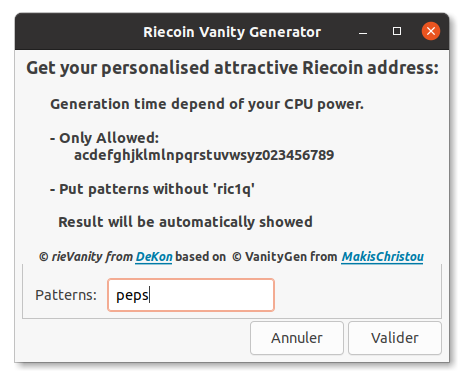
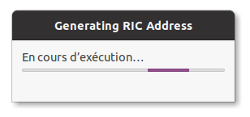
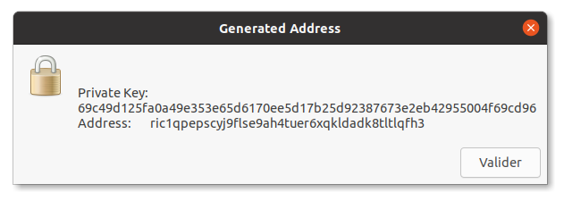
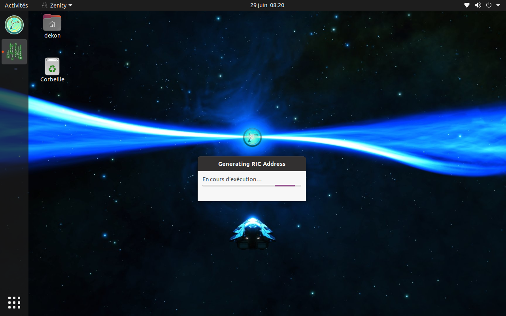
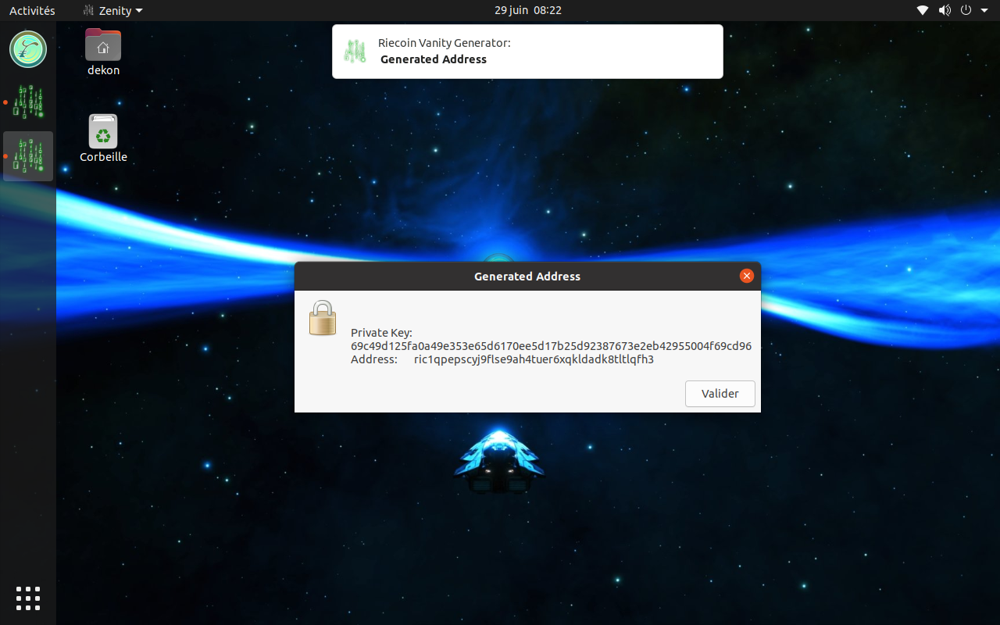

# rieVanity
<h3><b>Riecoin Vanity Generator GUI</b></h3> 
For Debian and Ubuntu - 64bit 
Work with Riecoin VanityGen integrated in .deb 
 
<b>Install :</b>  
Download the deb release. 
Click on the deb package and the system installer will open to install it.  
Or  
Open a terminal and type : 
<code>sudo dpkg -i rievanity.deb</code>  
<b>Uninstall :</b>  
Click on the deb package and the system installer will open to uninstall it.  
Or  
Open a terminal and type : 
<code>sudo apt remove rievanity</code>  
  
1 - Type only patterns you want : 

2 - Wait until finish : 

3 - Select the text and with a right click copy it to paste it where you want to save your keys : 

- Let the generator work for you :

- Always with OS notification :

